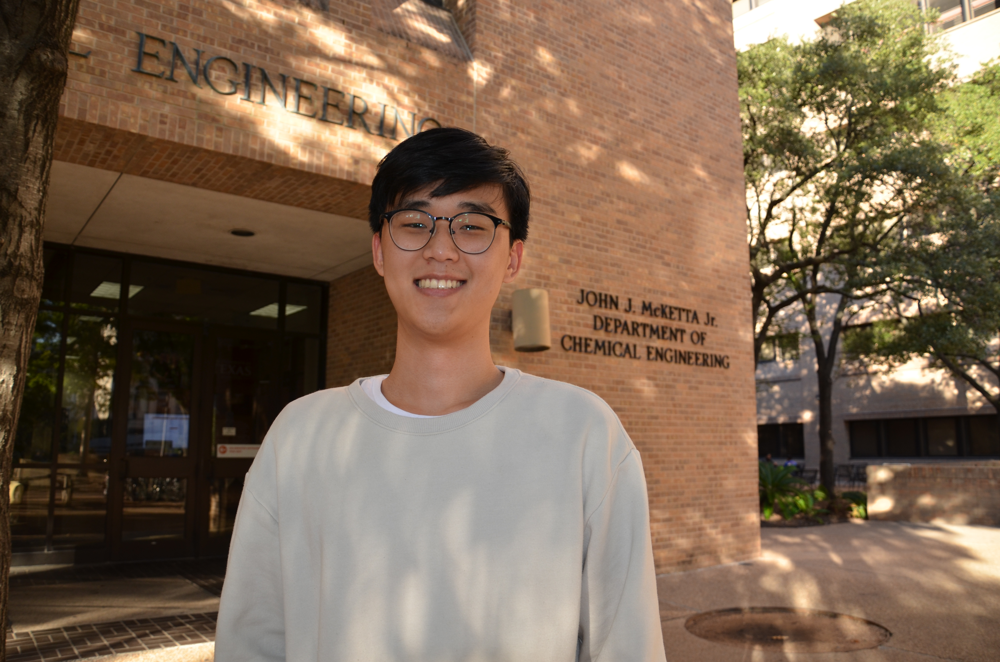

 
    

 <b>Briana;ldsfaj;lsk Lee, Graduate Student</b>   <em>Research Assistant</em> 

 <a href="https://wangmaterialsgroup.com/" target="blank">Texas Materials Institute</a> 
<a href="https://utexas.edu" target="blank">The University of Texas at Austin</a>

 <a href="files/brianlee_cv.pdf">CV </a> 

 

I joined the [University of Texas at Austin](https://utexas.edu) to pursue my PhD in Materials Science and Engineering where I am studying defect complexes using computational methods with [Prof. Wennie Wang](https://www.che.utexas.edu/people/faculty/wang) as my principal advisor

I obtained my BS in Chemistry from [Texas A&M University](http://tamu.edu/) in December 2021, where I researched under [Prof. Lei Fang in the Department of Chemistry](https://www.chem.tamu.edu/rgroup/fang/), working on superhydrophobic materials.

Upon graduating from Texas A&M, I worked as an organic chemist at [American Biochemicals](https://www.americanbiochemicals.com/) where we worked on custom organic synthesis, purification, and characterization.

<h2>Publication</h2>

Li, C.; Lee, B.; Wang, C.; Bajpayee, A.; Douglas, L. D.; Phillips, B. K.; Yu, G.; Rivera-Gonzalez,
N.; Peng, B.; Jiang, Z.; Sue, H.-J.; Banerjee, S.; Fang, L.
 <b>Photopolymerized Superhydrophobic
Hybrid Coating Enabled by Dual-Purpose Tetrapodal ZnO for Liquid/Liquid Separation.</b>.
<em>Materials Horizons, 2022</em>,
  [https://doi.org/10.1039/d1mh01672e](https://doi.org/10.1039/d1mh01672e).

